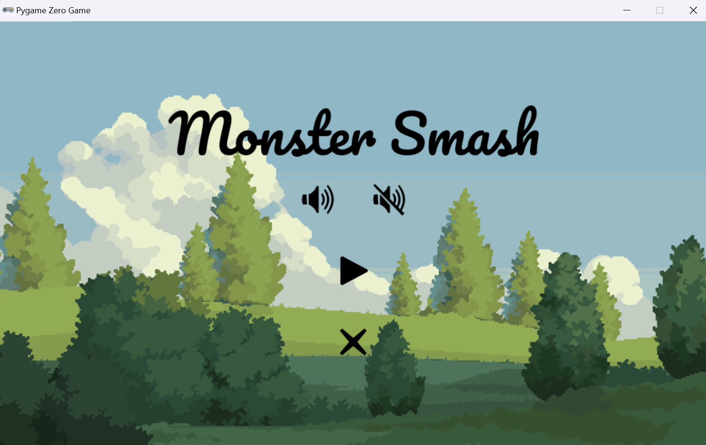
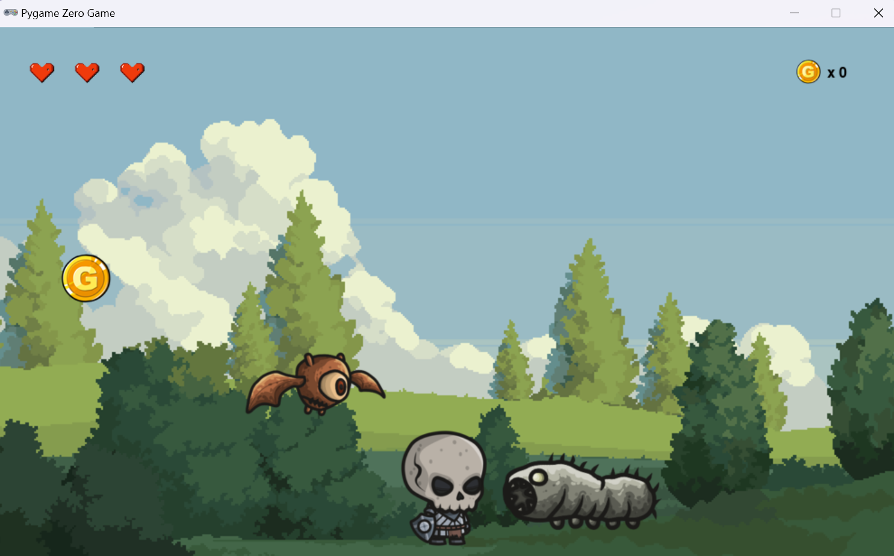

# 🎮 PyGame Zero Simple Game


A simple game created using [PyGame Zero](https://pygame-zero.readthedocs.io/en/stable/) — a beginner-friendly game framework built on top of Pygame.

This project is perfect for those who are just getting started with game development in Python.

## 📦 Features

- Simple gameplay mechanics
- Player controls and movement
- Collision detection
- Score tracking
- Sprite character animations
- Background music and sound elements
- Turn on/off the bacground music
- Basic game loop

## 🚀 Getting Started

### Requirements

- Python 3.6+
- [PyGame Zero](https://pygame-zero.readthedocs.io/en/stable/)

### Installation

1. **Clone the repository**:

   ```bash
   git clone https://github.com/davutbayik/pygame-zero-simple-game.git
   cd pygame-zero-simple-game

2. **Create and activate a virtual environment (Optional-Recommended)**:
   ```bash
   python -m venv .venv
   source .venv/bin/activate  # On Windows: .venv\Scripts\activate

3. **Install the required packages**:
   ```bash
   pip install -r requirements.txt

4. **Run the game**:
   ```bash
    pgzrun game.py

## 🕹 Controls

| Key            | Action             |
|----------------|--------------------|
| Arrow Keys     | Move player        |
| Space          | Attack             |

## 🧠 How It Works

This game uses [PyGame Zero](https://pygame-zero.readthedocs.io/en/stable/), a beginner-friendly library that simplifies writing games in Python.

The core structure includes:

- `draw()` — Renders game elements on the screen every frame.
- `update()` — Updates game logic like movement, collisions, or score.
- Assets (like images and sounds) are loaded automatically from the `images/` and `sounds/` folders, based on filenames.

You define actors (e.g., the player or enemies) using `Actor()` and control them using keyboard input. PyGame Zero manages the game loop behind the scenes.

## 🎯 Goals

The primary goals of this project are:

- ✅ Demonstrate how to build a simple 2D game using Python and PyGame Zero
- ✅ Provide a hands-on learning example for beginners in game development
- ✅ Encourage experimentation by using a clean and minimal code structure
- ✅ Offer a starting point to expand with more features

## 🛠️ Customize

Feel free to customize and expand the game! Some ideas include:

- 🎨 Add more levels or scenes
- 🧠 Add simple AI for enemies
- 🏆 Create a high score table
- 🌎 Add support for different screen sizes or full-screen mode

Let your imagination guide you — it’s a great way to practice Python while having fun!

## 🖼 In-Game Screenshots

The images below shows in game screenshots from start menu and game loop.





## 🤝 Contributing

Contributions are welcome and appreciated! If you’d like to improve this project, here’s how you can help:

- 🐞 Report bugs or issues.
- 🌟 Suggest new features or improvements.
- 🔀 Fork the repo, make your changes, and submit a pull request.

Please make sure your code follows best practices and includes proper documentation where necessary.

## 📄 License

This project is licensed under the terms of the [MIT License](LICENSE).  
You are free to use, modify, and distribute this software as long as you include the original license.

## 📬 Contact

Made with ❤️ by [Davut Bayık](https://github.com/davutbayik) — feel free to reach out via GitHub for questions, feedback, or collaboration ideas.

---

⭐ If you found this project helpful, consider giving it a star!
